# WindowsServerAD
Instalando serviços do Active Directory utilizando Windows Server 2012 R2

Configuração do Windows Server 2012 R2 como um servidor Active Directory.

Após a criação da máquina virtual com Windows server 2012 R2 e subir o sistema estando ok para configurá-lo. Abri o gerenciador do servidor e fui até adicionar recursos (add roles and features)
 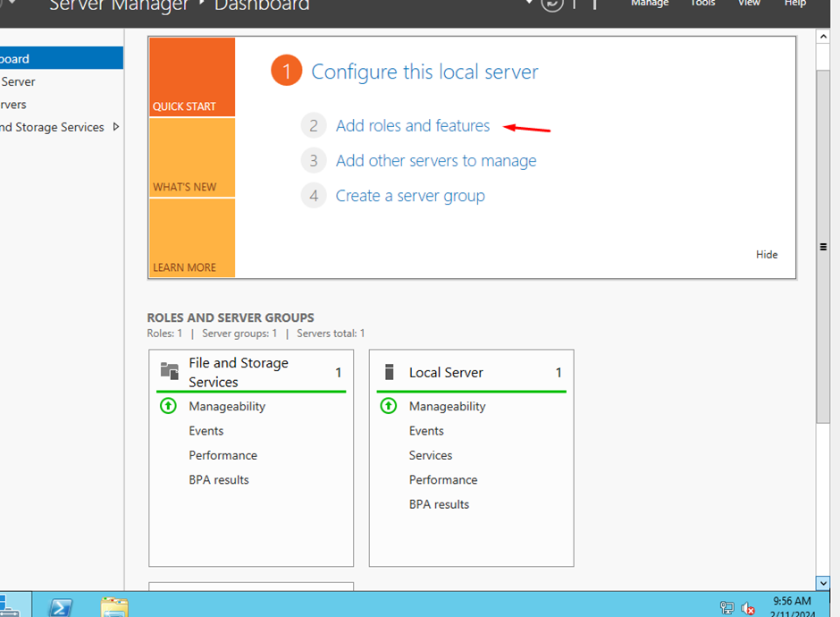

Agora abrimos o menu de instalação para poder instalar  o AD (active directory):
 
  

 Com isso iremos escolher o tipo de instalação na qual podemos fazer a base ou a com serviços de acesso remoto no qual tem requerimento de baixar recurso de (VDI) 
  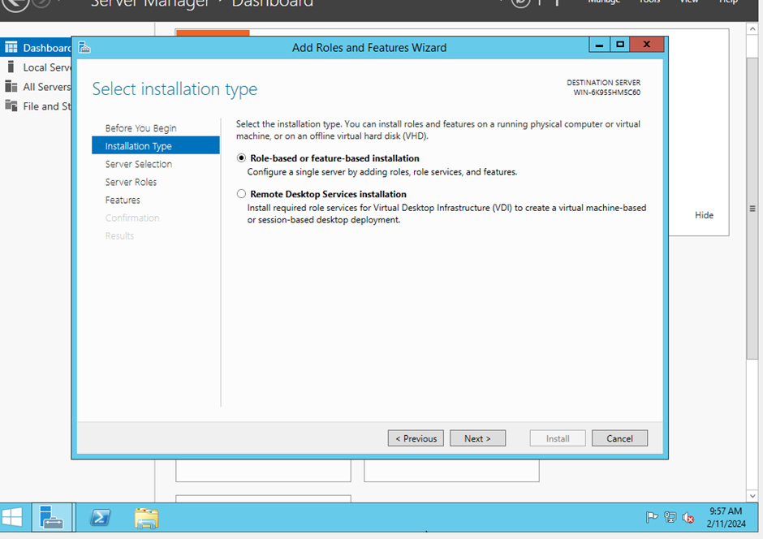
Aqui temos a escolha do servidor se irá ser selecionado a parti de um Virtual HD ou pelo pool

  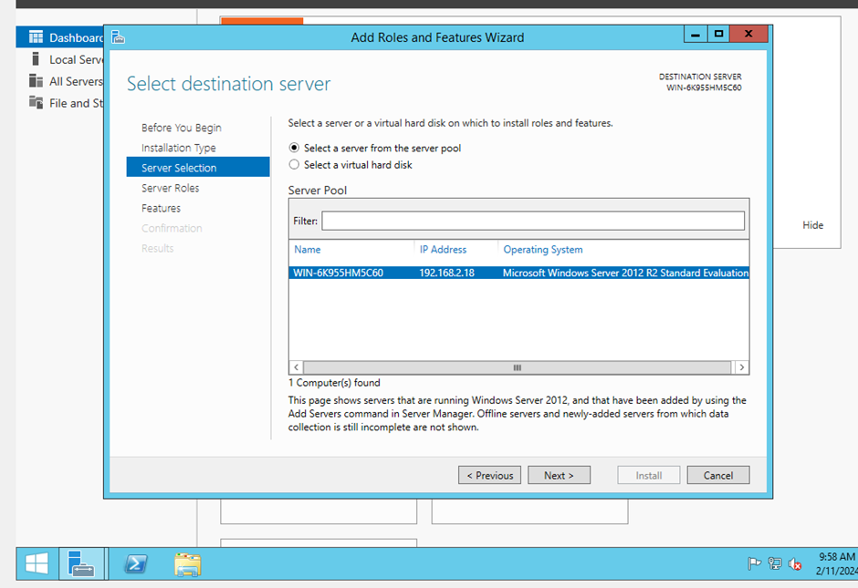

Agora iremos adicionar o serviço de domínios do AD (Podemos ativar outros serviços, porém só ativei o AD DOMAIN SERVICES):
 
  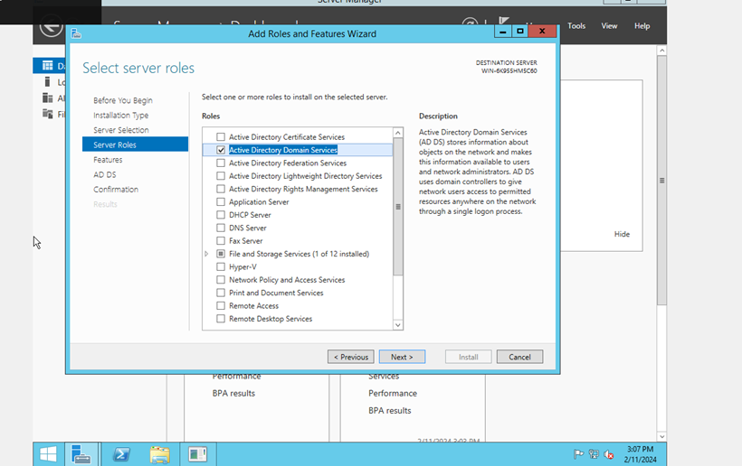

Logo após tem a aba de features no qual podemos escolher para ser instalado por exemplo o sistema de backup do Windows server, mas coloquei para pular direto a confirmação.

  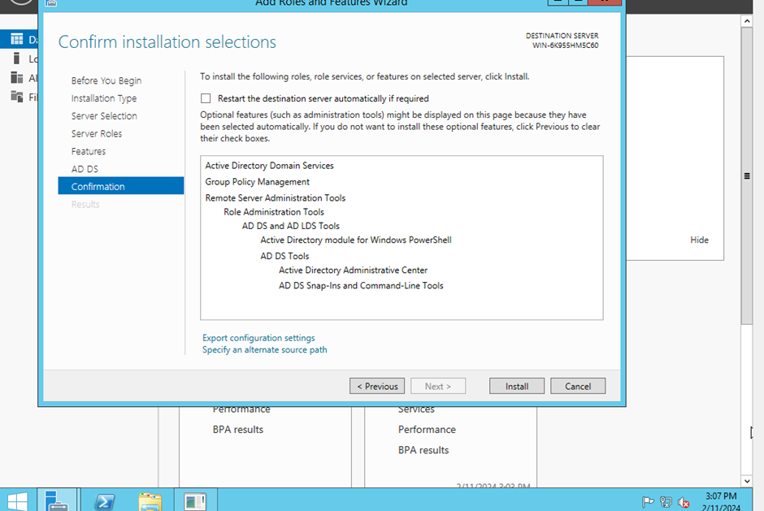

 
Ao terminar a instalação podemos estar promovendo o servidor para o controlador de domínio

  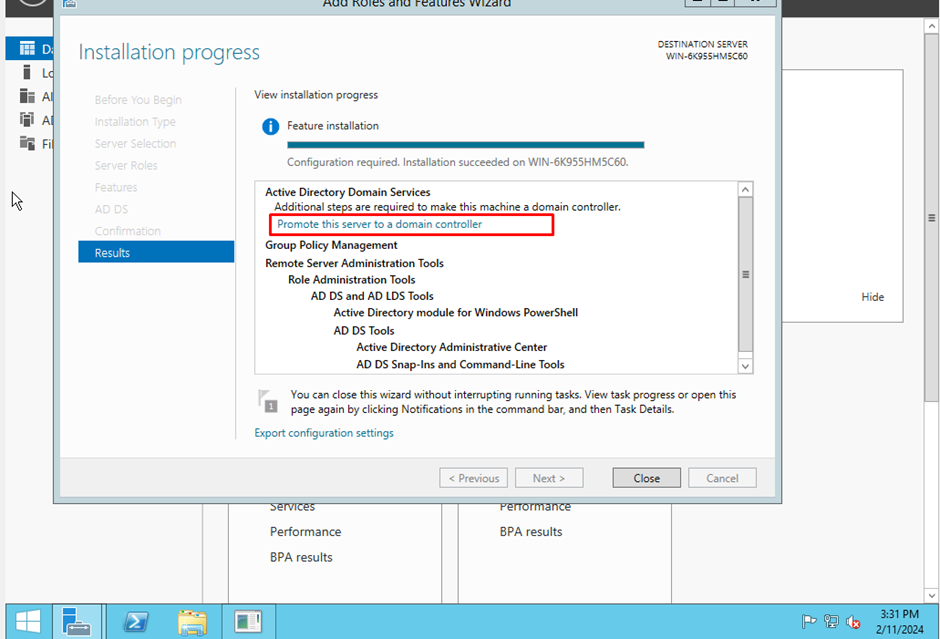

E nisso irá aparecer algumas funções, mas como estamos começando do zero, a gente criará uma arvore e colocando o nome do domínio.

   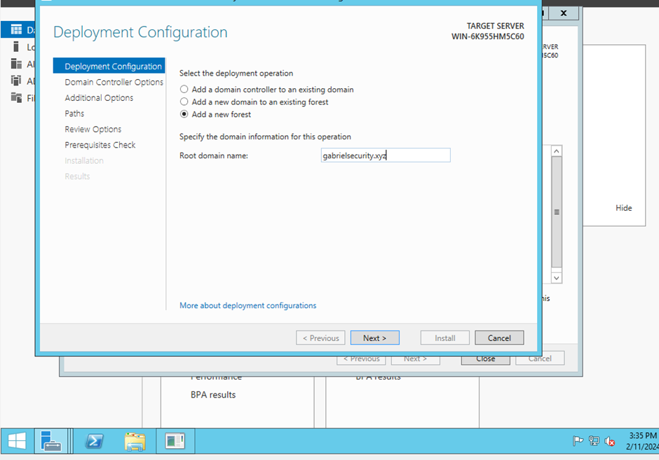

 

Colocar senha para modulo de restore de serviços

   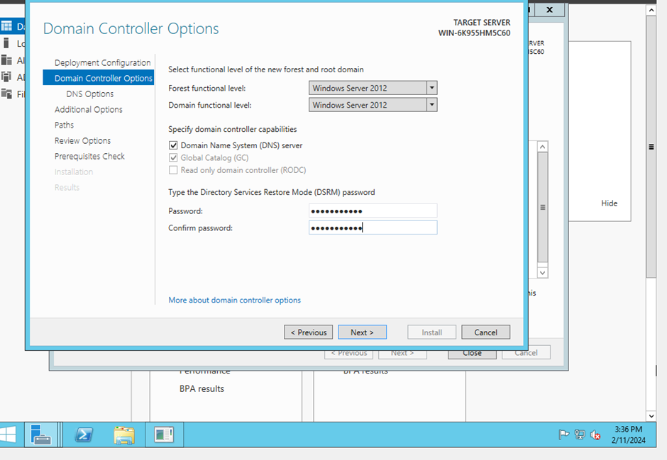

OBS: Não tem como colocar delegação de domínios por que o DNS não foi instalado

  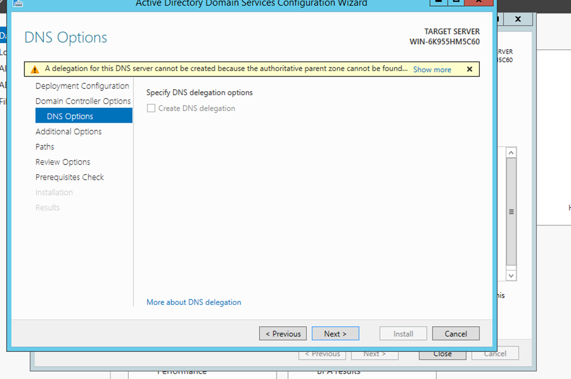

 

Após dar next até em checagem de requisitos no qual irá analisar se ele tem o requisito para uso. Se tiver OK tudo, só instalar.
  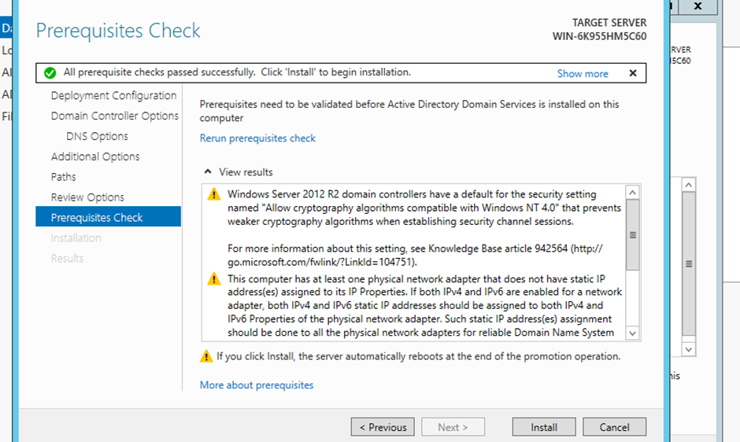

 

Após a instalação do serviço iremos abrir o gerenciador do servidor>ferramentas> active directory usuários e computadores.

   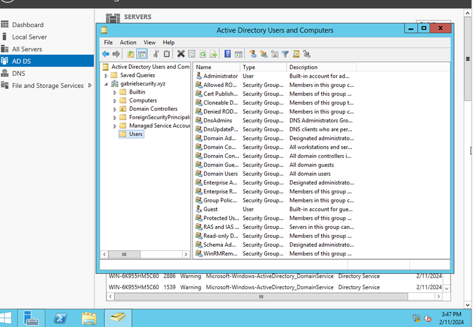
